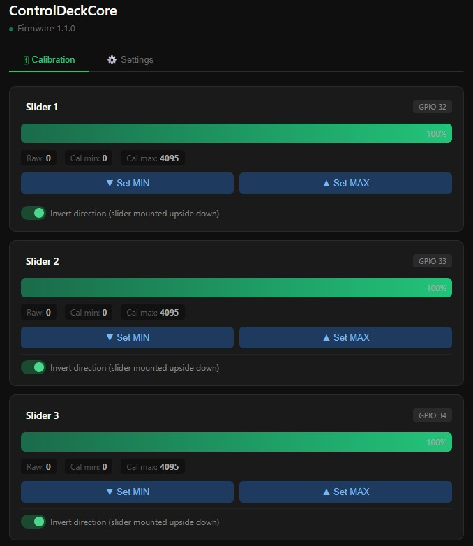
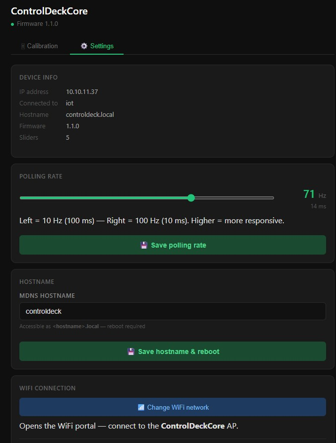

# ControlDeck

A hardware volume mixer — control audio sessions on your PC with physical sliders.

Inspired by [deej](https://github.com/omriharel/deej) by Omri Harel. Similar hardware concept — potentiometers wired to a microcontroller over USB — rebuilt from scratch with a modern ESP32 controller, wireless OTA firmware updates, and a native Windows desktop app.

---

## What's in this repo

| Folder | What it is |
|--------|------------|
| [`ControlDeckCore/`](ControlDeckCore/) | ESP32-WROOM-32 firmware (PlatformIO + Arduino) |
| [`ControlDeck/`](ControlDeck/) | Windows desktop app (C# / .NET 8 / WinForms) |

---

## How it works

```
 [Potentiometer sliders]
         │
         │ analog voltage
         ▼
 [ESP32-WROOM-32]          ← ControlDeckCore
         │
         │ USB serial (CDC2 protocol, 100 Hz)
         ▼
 [ControlDeck.exe]         ← ControlDeck
         │
         │ Windows Core Audio API
         ▼
 [master / mic / chrome.exe / discord.exe ...]
```

1. Each potentiometer wiper connects to an ADC1 pin on the ESP32
2. ControlDeckCore reads up to 6 sliders at 100 Hz, filters noise, and streams values over USB serial
3. ControlDeck receives the stream, maps each slider to an audio target, and sets volume via the Windows Core Audio API
4. Configuration is done via a system tray icon — double-click to open, assign sliders, save

---

## Hardware

| Component | Details |
|-----------|---------|
| Microcontroller | ESP32-WROOM-32 DevKit (NodeMCU-32S, 38-pin) |
| USB bridge | CP2102 (Silicon Labs) — shows as *CP210x USB to UART Bridge* |
| Cable | USB Mini-B |
| Sliders | Up to 6 × 10kΩ linear potentiometer (B10K) |

Slider wiring — GPIO pins safe for analog with WiFi active:

| Slider | GPIO |
|--------|------|
| 1 | 32 |
| 2 | 33 |
| 3 | 34 |
| 4 | 35 |
| 5 | 36 |
| 6 | 39 |

See [`ControlDeckCore/docs/hardware.md`](ControlDeckCore/docs/hardware.md) for full wiring guide.

---

## Quick Start

### Flash the firmware

```bash
cd ControlDeckCore
pio run -t upload          # requires PlatformIO
pio device monitor         # verify CDC2 handshake output
```

On first boot the ESP32 opens a WiFi AP called **ControlDeckCore** — connect to it and enter your network credentials for OTA support.

### Run the desktop app

```bash
cd ControlDeck
dotnet run                 # requires .NET 8 SDK
```

Or grab the pre-built `ControlDeck.exe` from [Releases](../../releases).

---

## Protocol

ControlDeckCore and ControlDeck communicate over a simple line-based serial protocol:

```
← CDC2:SLIDERS=4;VERSION=1.0.0;NAME=ControlDeckCore   (handshake on connect)
← V:512|780|0|4095                                     (data frame, ~100 Hz)
→ CMD:PING                                             (PC → device)
← ACK:PONG
```

Values are 12-bit (0–4095). Full spec in [`ControlDeckCore/docs/protocol.md`](ControlDeckCore/docs/protocol.md).

---

## OTA Firmware Updates

After the first USB flash, all future updates can be pushed wirelessly:

```bash
cd ControlDeckCore
pio run -t upload --upload-port controldeck.local
```

## Screenshots




---

## Credits

- [deej](https://github.com/omriharel/deej) by Omri Harel — the original inspiration
- [NAudio](https://github.com/naudio/NAudio) — Windows audio library used in ControlDeck
- [PlatformIO](https://platformio.org/) — firmware build system
- [WiFiManager](https://github.com/tzapu/WiFiManager) — captive portal WiFi provisioning
